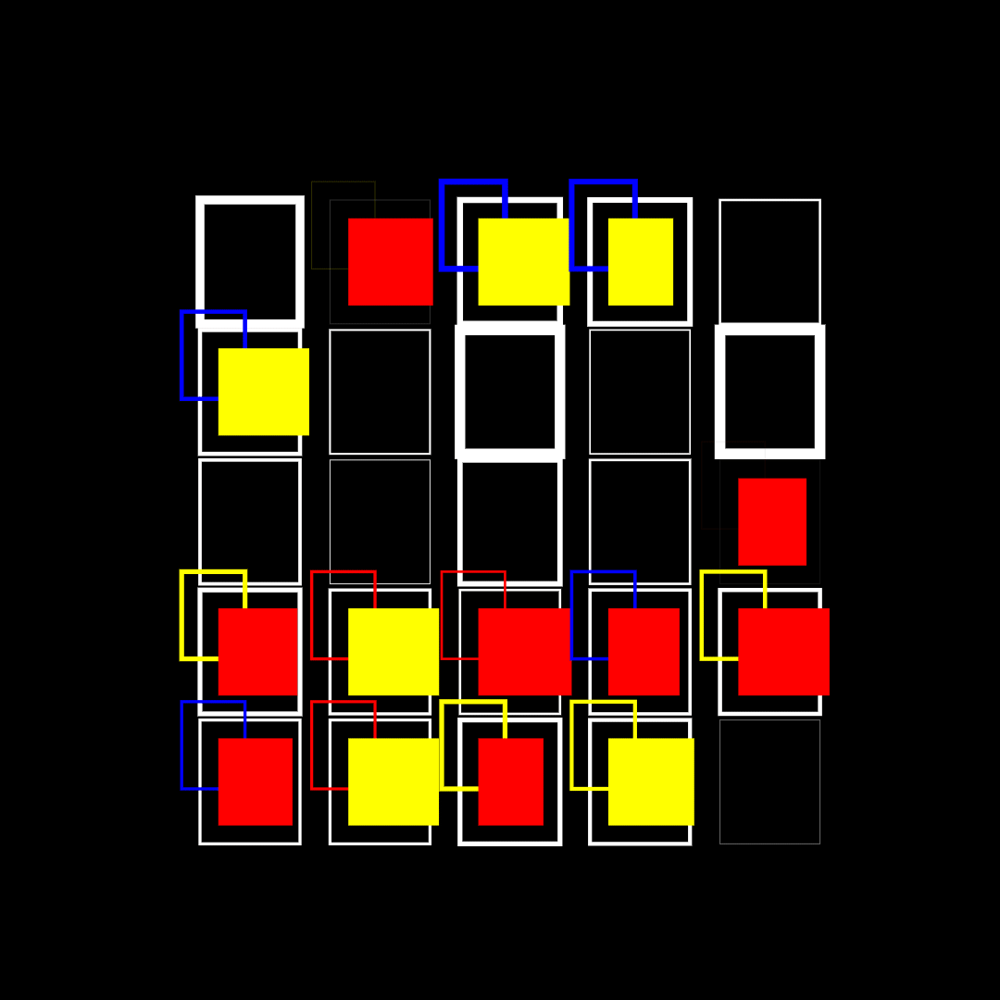

Credits.
I took the Domestika course on creative coding. https://www.domestika.org/en/courses/2729-creative-coding-making-visuals-with-javascript

Examples below are some visuals made from these sketchs. Although at the time of writing this some of the sketches have evolved and have taken different forms than shown.

